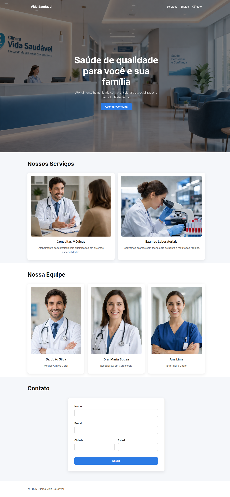
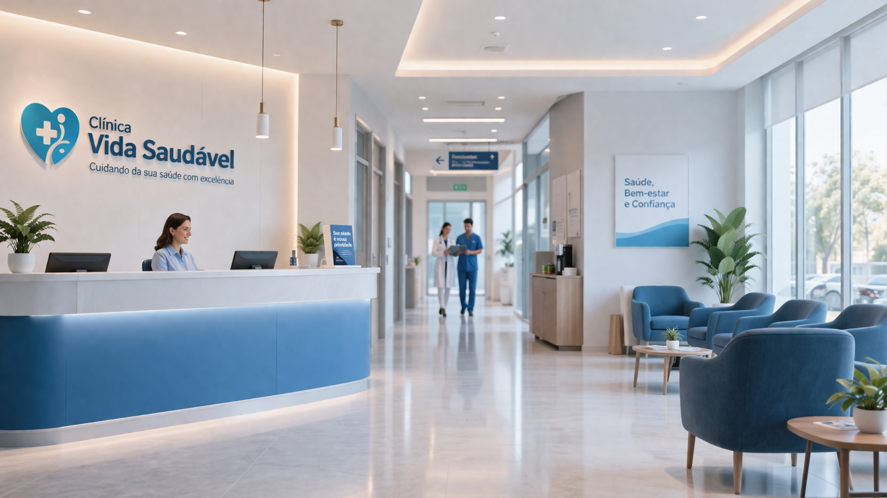

# Clínica Vida Saudável - Landing Page

[]()
[]()
[]()

Landing page institucional para uma clínica médica fictícia, desenvolvida com foco em boas práticas de front-end, layout moderno e responsividade.

---

## Preview



Acesse: https://zerther-the-dev.github.io/clinica-landing

---

## Como Executar o Projeto

### Opção 1: Abrir diretamente no navegador
Basta abrir o arquivo: index.html

---

### Opção 2: Usando servidor local (recomendado)

####  VS Code (Live Server)

1. Instale a extensão **Live Server**
2. Clique com o botão direito no `index.html`
3. Selecione **"Open with Live Server"**

---

####  Usando Node.js

Caso tenha Node instalado: npx live-server

---

#### 🔹 Qualquer IDE

- IntelliJ / WebStorm → botão direito no HTML → "Open in Browser"
- RubyMine → mesma abordagem
- Navegador direto também funciona

---

## Como Utilizar a Landing Page em Outro Projeto

Para reutilizar essa landing em outro projeto:

### 1. Copie os arquivos necessários

index.html
style.css
script.js
img/

---

### 2. Ajuste os caminhos (se necessário)

Verifique no HTML:
<link rel="stylesheet" href="style.css"> <script src="script.js"></script>  ```

## Funcionalidades

### Navbar Fixa com Scroll Dinâmico
- Fixa no topo da página
- Alteração de estilo ao rolar (transparente → sólido)
- Navegação suave entre seções

### Hero Section
- Ocupa toda a altura da tela (`100vh`)
- Imagem de fundo com overlay escuro
- Conteúdo centralizado
- Botão de chamada para ação

### Seção de Serviços
- Cards com imagem, título e descrição
- Layout em Flexbox
- Efeito hover com elevação

### Seção da Equipe
- Exibição dos profissionais
- Cards reutilizáveis
- Estrutura consistente com serviços

### Formulário de Contato
- Campos:
  - Nome
  - E-mail
  - Cidade
  - Estado
- Inputs estilizados com foco visual
- Layout adaptável para mobile

### Responsividade
- Media queries para telas menores
- Cards empilhados no mobile
- Ajustes de tipografia
- Correção de overflow horizontal

---

## Tecnologias Utilizadas

- HTML5
- CSS3 (Flexbox, Media Queries)
- JavaScript (interações da navbar)

---

## Como Executar

### Opção 1: Abrir direto no navegador
Abra o arquivo: index.html

### Opção 2: Servidor local (recomendado)

Terminal: npx live-server

## Boas Práticas Aplicadas:
- Uso de box-sizing: border-box
- Prevenção de overflow horizontal
- Layout responsivo com Flexbox
- Separação clara de responsabilidades
- Componentização com classes reutilizáveis
- Hierarquia tipográfica consistente

## Melhorias Futuras
- Menu hamburger para mobile
- Validação de formulário com JavaScript
- Integração com backend/API
- Animações com scroll
- Acessibilidade (ARIA, navegação por teclado)

## Licença

Este projeto está sob a licença MIT.

## Autor

Lucas Pereira Alves